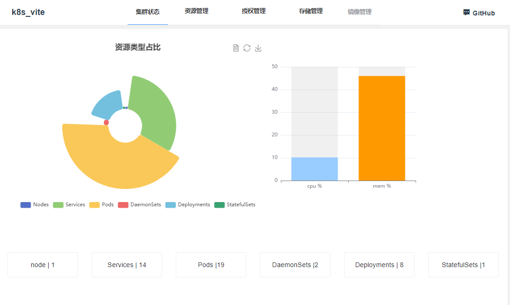
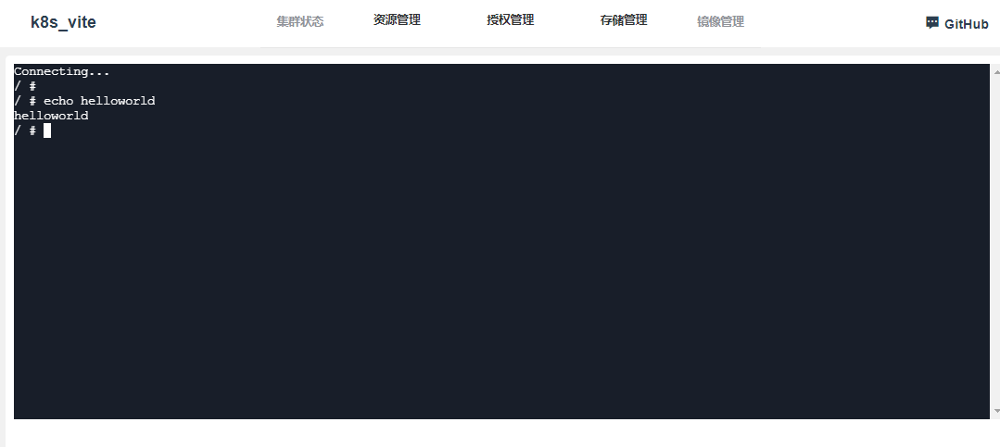

# Vite2.x + Vue3.x + Xtermjs4

[在线体验地址](http://114.67.110.204:4500/login)
1
## 相关信息
- 编程语言：[TypeScript 4.x](https://www.typescriptlang.org/zh/) + [JavaScript](https://www.javascript.com/)
- 构建工具：[Vite 2.x](https://cn.vitejs.dev/)
- 前端框架：[Vue 3.x](https://v3.cn.vuejs.org/)
- 路由工具：[Vue Router 4.x](https://next.router.vuejs.org/zh/index.html)
- 状态管理：[Vuex 4.x](https://next.vuex.vuejs.org/)
- UI 框架：[Element Plus](https://element-plus.org/#/zh-CN)
- CSS 预编译：[Stylus](https://stylus-lang.com/) / [Sass](https://sass.bootcss.com/documentation) / [Less](http://lesscss.cn/)
- HTTP 工具：[Axios](https://axios-http.com/)
- 后端地址: [kube_web](https://github.com/haozheyu/kube_web)

### 安装依赖

```sh
npm install
# or
yarn add
```

### 启动项目

```sh
npm run dev
```

### 项目打包

```sh
npm run build
```

### 功能完成
#### 2021/6/8
pod 的ssh登录






